<div align="center">

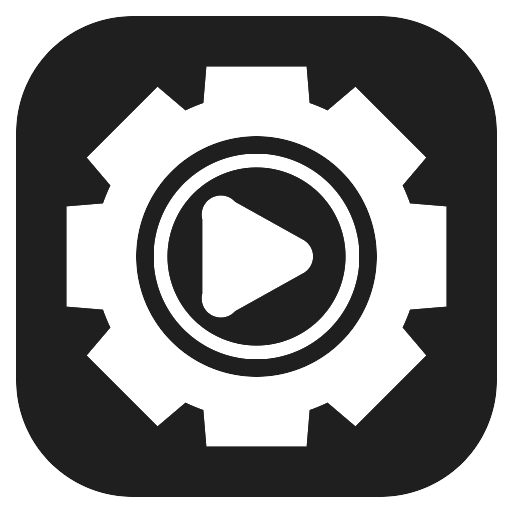

# Stream Vault

**A local-first desktop app for any folder of videos you watch in sequence.**

Courses, lecture series, conference talks, tutorials, TV seasons, family recordings: point Stream Vault at a folder,
and it indexes, plays and remembers where you stopped. No cloud, no account, no telemetry.

[](https://github.com/princeneres/stream-vault/releases/latest)
[](https://tauri.app)
[](https://react.dev)
[](https://www.rust-lang.org)
[](https://www.sqlite.org)
[](#installation)

[Download](https://github.com/princeneres/stream-vault/releases/latest) ·
[Features](#features) ·
[Screenshots](#screenshots) ·
[Build from source](#build-from-source) ·
[Architecture](#architecture)

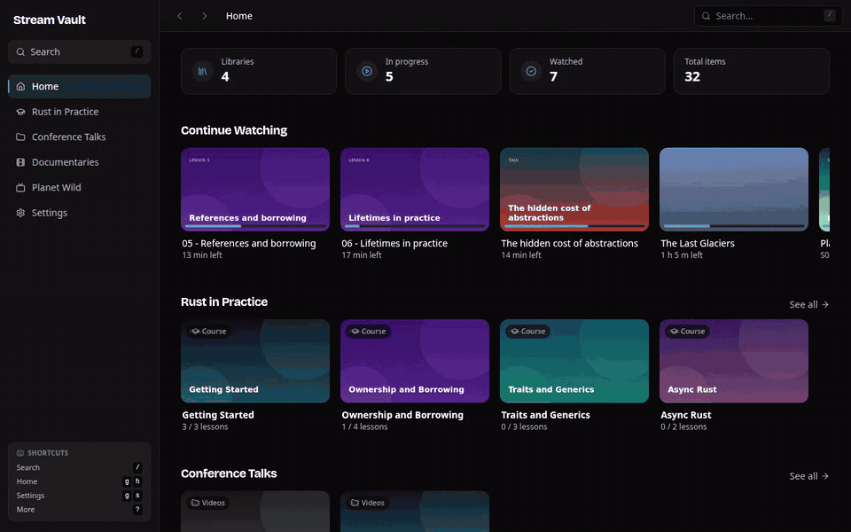

</div>

## Why Stream Vault?

If you have folders of videos you mean to watch in order (a downloaded course, a backlog of talks, a season of a
show), you probably juggle a video player, a file manager and a spreadsheet to remember what you already watched.
Stream Vault replaces that with one app that reads the folder as it is, plays it in place and keeps the progress.
Your files never move and nothing leaves your machine.

## Features

**Library**

- **Any folder layout.** The default *Video folder* preset mirrors your folders as they are. Optional presets handle
  *Course* (nested modules, leading numbers set the order), *TV series* (season folders and `SxxExx` names) and
  *Movies* (flat, poster grid).
- **Custom unit labels.** Call items "lesson", "talk", "episode" or "part", and the UI uses that term everywhere.
- **Incremental rescans.** Files are matched by path, so IDs and progress survive rescans and preset changes.
- **Automatic artwork.** Thumbnails and posters are generated with `ffmpeg` after each scan. Any thumbnail can
  become a group poster.
- **Attachments.** PDFs, images, archives and other files next to the videos are listed with each group, with
  image and PDF previews.

**Playback**

- **Built-in player.** An HTML5 player streams from an in-process localhost server with byte-range support, so
  seeking, speed control and MP4s with the index at the end work natively, with no re-encoding.
- **Resume everywhere.** Progress is saved every 3 seconds, and an item counts as watched past 90%.
- **Continue Watching** on the home screen, ordered by recency, plus optional auto-advance to the next item.
- **In-player playlist** (<kbd>P</kbd>) to jump anywhere in the library without leaving the player.
- **Keyboard first.** Seek, volume, speed, fullscreen, jump to 0–90%, and <kbd>?</kbd> shows every shortcut.

**Notes and organization**

- **Timestamped notes.** Press <kbd>Alt</kbd>+<kbd>N</kbd> while watching to pause and write a note. Click a note
  later to seek straight to that moment.
- **Obsidian export.** Optionally publish notes to an Obsidian vault as one Markdown file per video, with an index
  per course. Text you write between the generated blocks is preserved.
- **Search and command palette** (<kbd>/</kbd> or <kbd>Ctrl</kbd>+<kbd>K</kbd>) across libraries, groups, items and
  navigation commands.
- **Six themes** (Dark, Light, Synthwave, Dracula, Emerald, Nord) and a reduced-motion switch.

## Screenshots

| Home | Course modules |
| --- | --- |
| 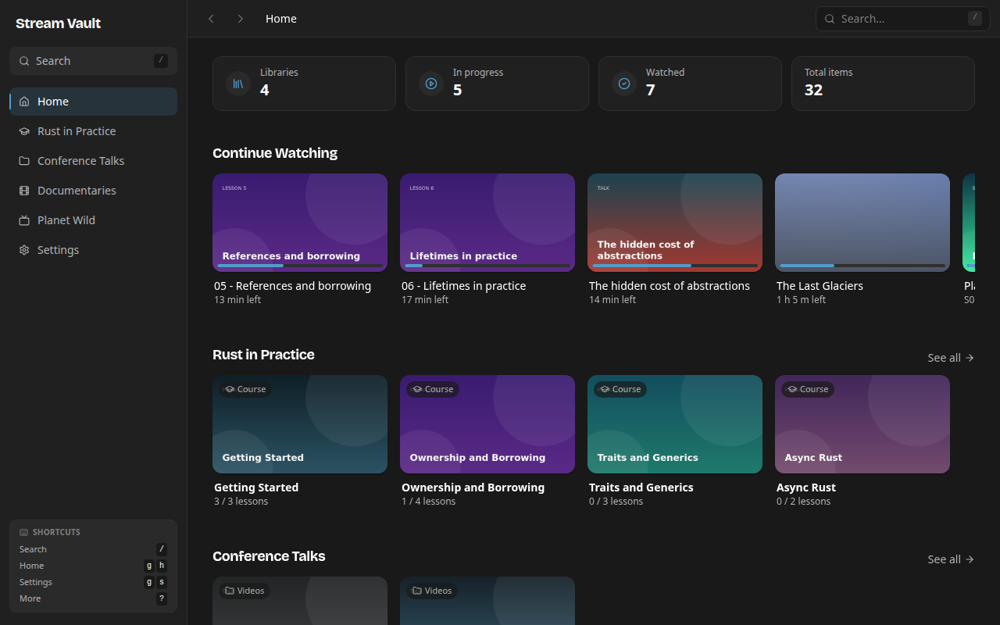 | 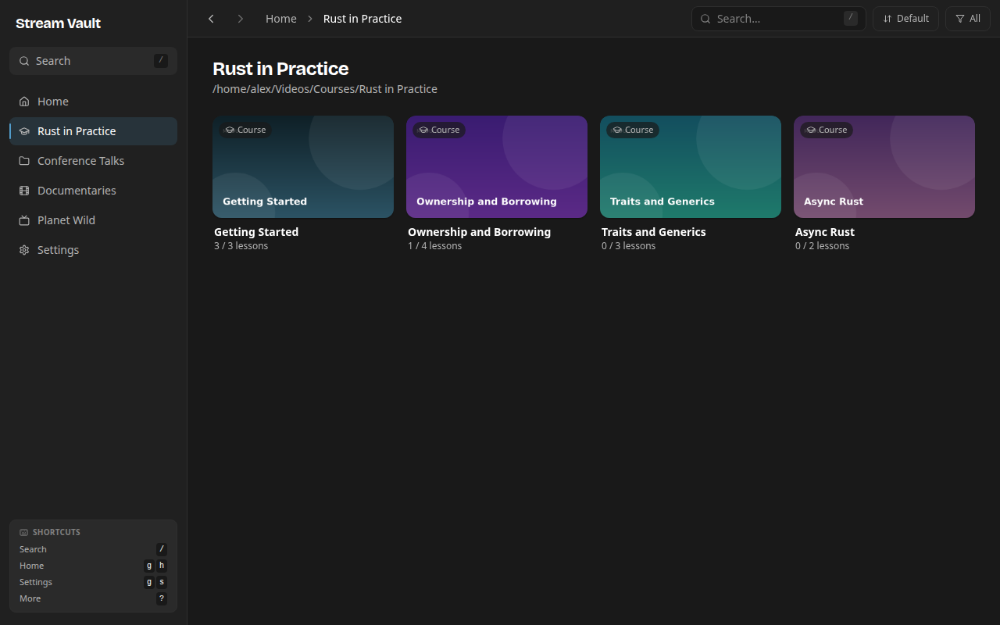 |
| **Module with lessons, attachments and notes** | **Player with resume position** |
| 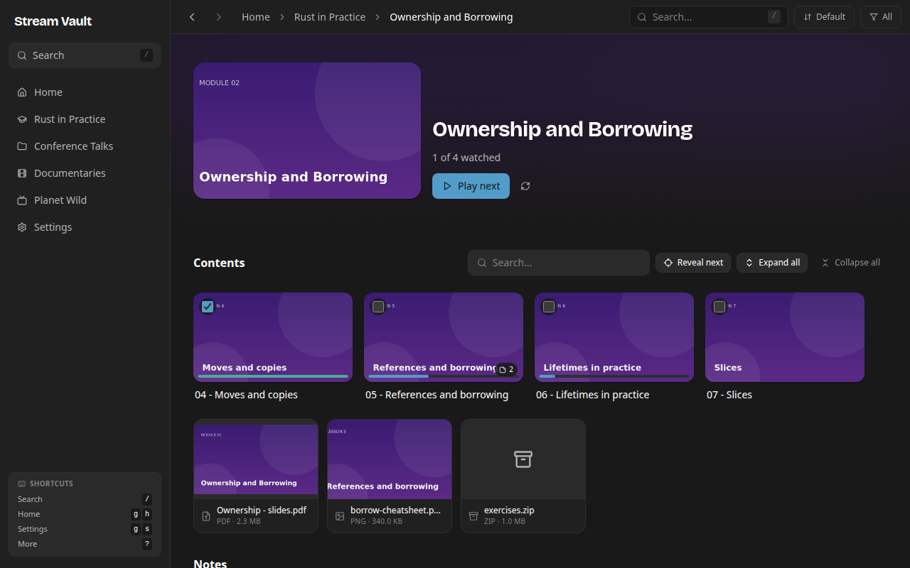 | 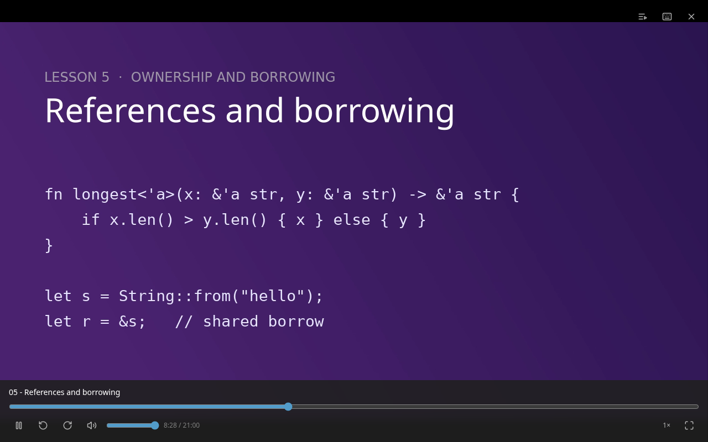 |
| **Movies preset** | **Command palette** |
| 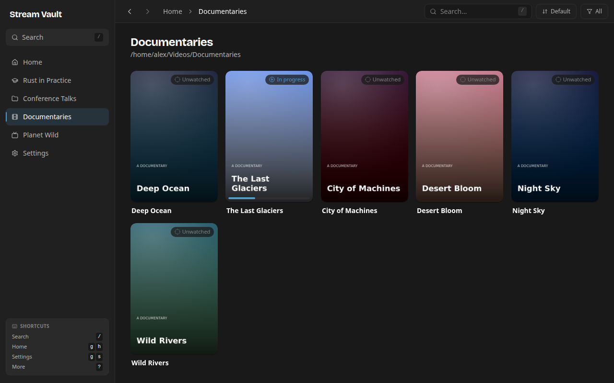 | 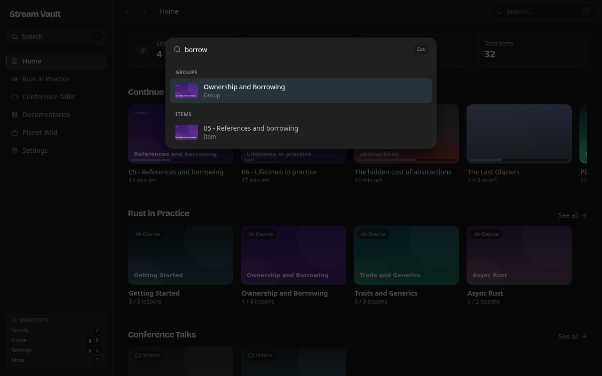 |

<details>
<summary><strong>Themes, settings and a full tour</strong></summary>

| Synthwave | Light | Nord |
| --- | --- | --- |
| 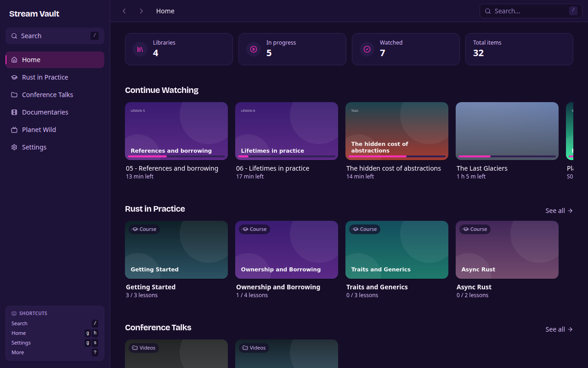 | 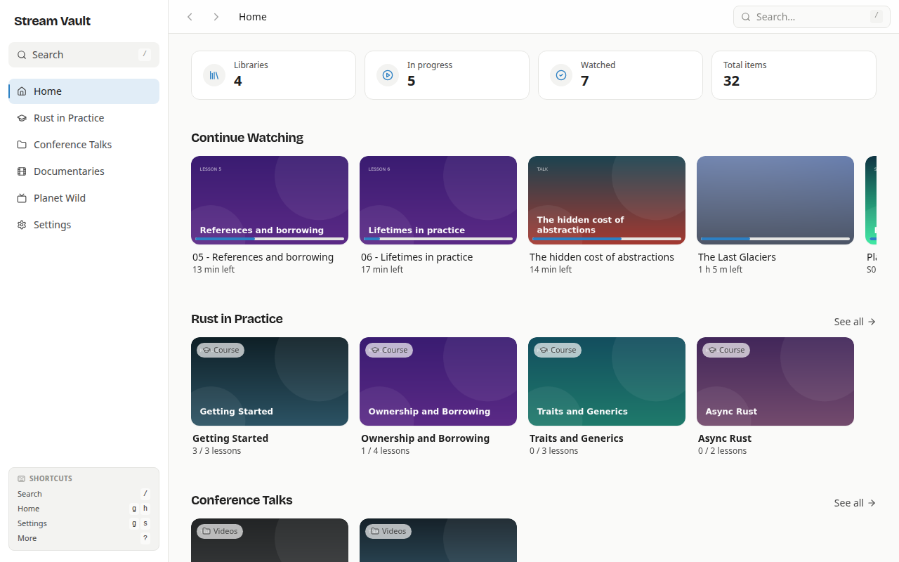 | 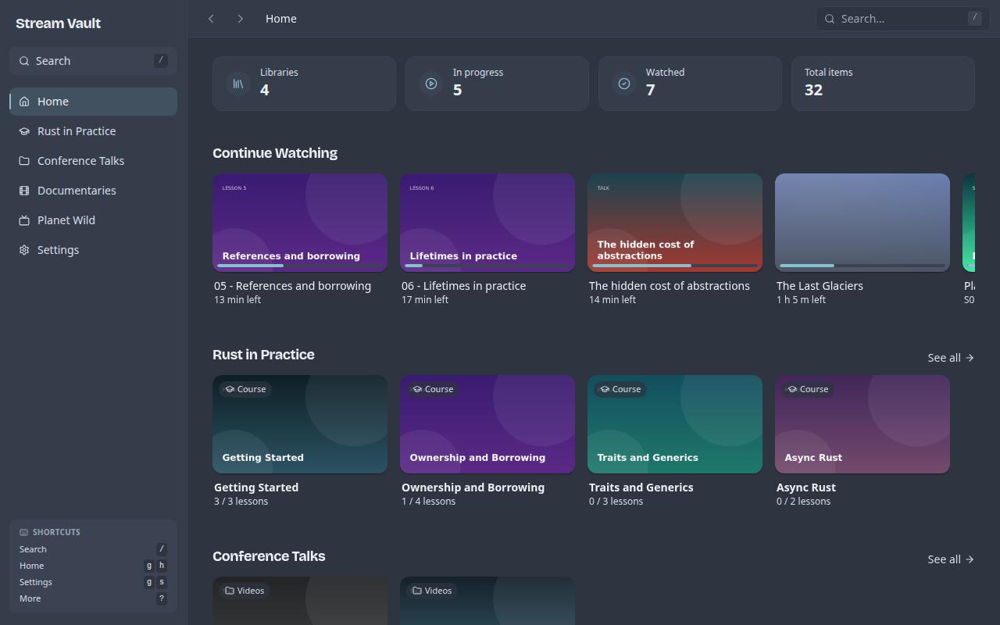 |

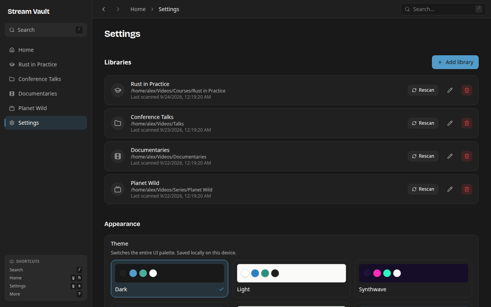


</details>

> The screenshots use fictional sample libraries.

## Installation

### Linux

Download the latest package from [Releases](https://github.com/princeneres/stream-vault/releases/latest):

| Package | Install |
| --- | --- |
| `.deb` (Debian, Ubuntu, Mint) | `sudo apt install ./Stream.Vault_*_amd64.deb` |
| `.rpm` (Fedora, openSUSE) | `sudo dnf install ./Stream.Vault-*.x86_64.rpm` |
| `.AppImage` (any distro) | `chmod +x Stream.Vault_*.AppImage && ./Stream.Vault_*.AppImage` |

Then launch **Stream Vault** from your application menu.

**Runtime dependencies**

| Tool | Used for | Required |
| --- | --- | --- |
| `ffmpeg` / `ffprobe` | Thumbnails, posters and durations | Yes (the `.deb` pulls it in) |
| `pdftoppm` (`poppler-utils`) | PDF attachment previews | Optional |

Windows and macOS builds are structured for but not shipped yet. Contributions are welcome.

### Quick start

1. Open **Settings → Add library** and pick a folder.
2. Keep the *Video folder* preset or choose *Course*, *TV series* or *Movies*. Optionally set a unit label.
3. Let the scan finish, then pick anything and press play.

To change a library's preset or label later, use **Edit** on the library in Settings. The rescan keeps your
progress.

Stream Vault stores its database (`streamvault.db`), thumbnails and posters under your platform's app data
directory. On Linux that is `~/.local/share/app.streamvault.dev/`.

## Build from source

**Prerequisites:** Node.js 20+, pnpm 10+, stable Rust ([rustup](https://rustup.rs)), `ffmpeg`, and the
[Tauri 2 system dependencies](https://tauri.app/start/prerequisites/). On Debian or Ubuntu:

```bash
sudo apt install -y libwebkit2gtk-4.1-dev build-essential curl wget file \
  libxdo-dev libssl-dev libayatana-appindicator3-dev librsvg2-dev ffmpeg poppler-utils
```

```bash
pnpm install
pnpm tauri dev                    # run the app with hot reload
pnpm tauri build                  # every bundle target
pnpm tauri build --bundles deb    # a single target
```

Bundles are written to `src-tauri/target/release/bundle/`.

Checks:

```bash
pnpm lint                         # TypeScript type check
cd src-tauri && cargo clippy && cargo test
```

## Architecture

```
src/                     React frontend
  views/                 Screens: Home, LibraryView, DetailView, Settings
  components/            Design system and composite UI (player, palette, dialogs)
  lib/api.ts             Typed wrappers around Tauri commands
  lib/types.ts           Shared contract, mirrors src-tauri/src/models.rs
src-tauri/src/
  commands.rs            Tauri command surface
  models.rs              Domain types
  db.rs                  SQLite schema and queries
  scanner/               One module per preset: generic, courses, series, movies
  media_server.rs        Localhost HTTP server used by the player
  thumbnails.rs          ffmpeg thumbnails and posters, ffprobe durations
  vault.rs               Obsidian vault publishing
```

**Domain model.** A **Library** is a root folder. It contains nested **Groups** (a module, a season, a folder)
and leaf **Items** (video files). **Progress** and **Notes** belong to items. The schema is the same for every
preset; the library `kind` only picks which scanner reads the folder.

**Playback flow.**

```
play(itemId)
  → get_item: item + saved progress
  → media_url: http://127.0.0.1:<port>/file?path=… (byte-range streaming from disk)
  → <video> seeks to the resume position
  → report_progress every 3 s; completed at ≥ 90 % of duration
  → item-progress event refreshes Home, lists and the playlist
```

The media server only serves files that live inside a configured library root, and vault writes are confined to
the configured vault folder.

## Roadmap

- [x] Editable library preset and custom unit labels
- [x] Built-in player with resume, playlist and keyboard shortcuts
- [x] Timestamped notes with Obsidian export
- [ ] Windows and macOS builds
- [ ] Watch history view
- [ ] Library import and export
- [ ] Opt-in metadata providers (TMDB, TVDB)
- [ ] Subtitle download

## Contributing

Issues and pull requests are welcome. Read [CONTRIBUTING.md](CONTRIBUTING.md) before opening a non-trivial
change, and report vulnerabilities privately as described in [SECURITY.md](SECURITY.md).

## License

No license has been chosen yet, so default copyright applies. See [Contributing](CONTRIBUTING.md#license).

---

<div align="center">

Built with [Tauri](https://tauri.app), [React](https://react.dev) and [ffmpeg](https://ffmpeg.org).

</div>
